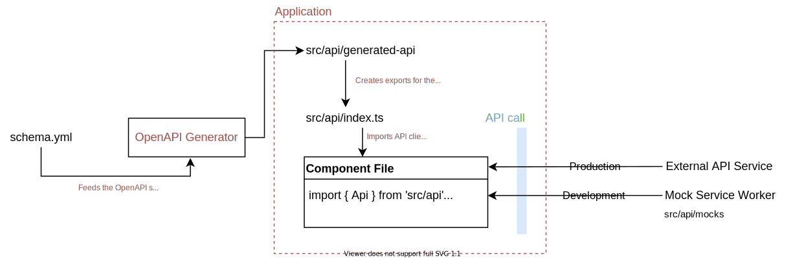

# OpenAPI Generator Example

This is an example usage of [openapi-generator](https://github.com/OpenAPITools/openapi-generator) with [typescript-fetch](https://github.com/OpenAPITools/openapi-generator/blob/master/docs/generators/typescript-fetch.md) generator.

## Getting Started

Requirements:

- node v12+
- yarn v1
- docker (for generating the api client)

Installation:

1. Clone the repository
2. Install dependencies
   ```bash
   yarn --frozen-lockfile
   ```
3. Generate the API client
   ```bash
   yarn generate-api
   ```
4. Run the application at [http://localhost:3000](http://localhost:3000)
   ```bash
   yarn dev
   ```

## Generating API client from schema

To (re-)generate the API client from schema, run:

```bash
yarn generate-api
```

It will read the `schema.yml` file in the working directory and pass it into the generator.
It can be customized by passing the schema filename:

```bash
yarn generate-api custom-schema.yml
```

The generated output will be in the `src/api/generated-api` directory.

## How it works



OpenAPI Generator imports specified `schema.yml` file and generates the API classes in `src/api/generated-api` directory.

The application creates ready-for-use API client with helpers for authentication in `src/api/index.ts`.

Components import API client methods and make API calls.

API calls are intercepted in development environment with Mock Service Worker and optionally served with mocked data on demand. In production environment the interceptor is disabled removed from the application bundle.
